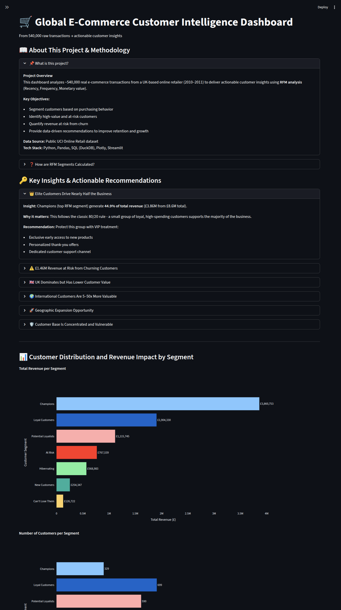

# 🛒 E-Commerce Customer Intelligence Dashboard

**Live Dashboard:** [Explore the interactive app here](https://daanandasilva-project1.streamlit.app/)

**£1.46M revenue at risk identified** - end-to-end RFM analysis on real e-commerce data with actionable insights.

## 🚀 Key Business Insights
- Champions drive **44.9%** of total revenue
- **£1.46M** at risk from vulnerable customers - win-back opportunity
- International customers 5–50x more valuable than average
- UK dominates revenue but lower customer value - growth lies abroad

## 🛠️ About This Project
Real-world transactional data → cleaned → SQL aggregation → RFM segmentation → interactive Streamlit dashboard.

**Tech Stack:** Python • Pandas • SQL (DuckDB) • Plotly • Streamlit

**Live App:** [Click here to explore](https://daanandasilva-project1.streamlit.app/)

Built to demonstrate data analyst skills: cleaning messy data, deriving insights, and communicating business impact.